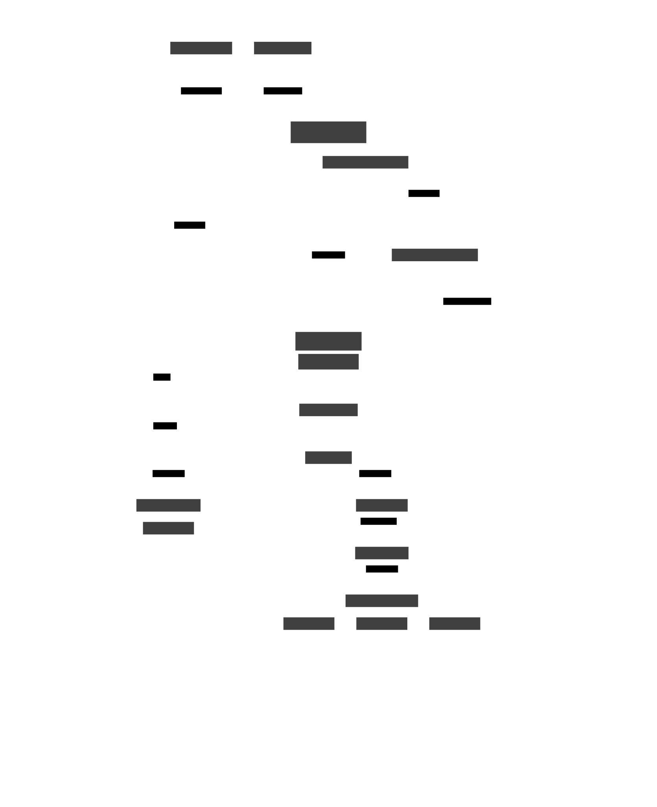

# Data Viz

Tool for exploratory and interactive data analysis.


## Features

### Chart Types

#### Data Tables

- **Data Table**: Interactive data table with sorting, filtering, and pagination
- **Pivot Table**: Interactive pivot table for data analysis with row/column aggregations and totals
- **Summary Table**: Display summary statistics for your data

#### Basic Charts

- **Bar Chart**: Display data as vertical bars with automatic binning for numerical data
- **Row Chart**: Horizontal bar chart showing values by category
- **Line Chart**: Display data as connected points over time or sequence with multiple series support
- **Scatter Plot**: Display data as points in a 2D space
- **Box Plot**: Display distribution of values with quartiles and outliers, with optional violin and bee swarm overlays

#### Advanced Visualizations

- **3D Scatter Plot**: Display data as points in a 3D space with interactive camera controls

#### Documentation and Annotations

- **Color Legend**: Display and manage color scales used in visualizations
- **Markdown**: Rich text content editor for documentation and annotations

### Common Features Across Charts

- Interactive brushing and filtering
- Faceted views with synchronized axes
- Color scale management
- Customizable axes and grid lines
- Responsive layouts
- Tooltips and hover interactions
- Export capabilities

### Data Analysis Features

- Real-time filtering and updates
- Multiple aggregation methods
- Date binning and formatting
- Statistical computations
- Dynamic data loading
- Cross-chart filtering

### User Interface

- Modern, responsive design using Tailwind CSS
- Customizable layouts and chart sizes
- Dark/light theme support
- Intuitive controls and settings panels

### Calculations

- Can create new columns based on existing columns

## Component Structure



## Chart Creation Process

The application uses a centralized chart registry system to manage all available chart types. This makes it easy to add new charts by registering them in a single location. Each chart is defined by implementing the `ChartDefinition` interface:

```typescript
interface ChartDefinition<TSettings> {
  // Metadata
  type: string; // Unique identifier for the chart type
  name: string; // Display name
  description: string; // Chart description
  icon: React.ComponentType; // Icon component for the chart

  // Core Components
  component: React.ComponentType; // The main chart component
  settingsPanel: React.ComponentType; // Settings panel for the chart

  // Settings Management
  createDefaultSettings: (layout, field?) => TSettings; // Creates default settings
  validateSettings: (settings) => boolean; // Validates settings
  getFilterFunction: (settings, fieldGetter) => Function; // Creates filter function
}
```

### Registry System

The chart registry (`registry.ts`) serves as a central hub for:

- Registering new chart types
- Retrieving chart definitions
- Managing chart type validation
- Providing type safety for chart settings

### Key Consumers of the Registry

1. **Chart Creation UI** (`ChartCreationButtons.tsx`)

   - Uses registry to display available chart types
   - Handles chart creation workflow

2. **Chart Rendering** (`ChartRenderer.tsx`)

   - Retrieves chart components for rendering
   - Manages chart-specific settings

3. **Settings Management** (`MainSettingsTab.tsx`)

   - Handles chart configuration
   - Provides settings UI based on chart type

4. **Data Layer** (`DataLayerProvider.tsx`)

   - Manages data filtering and updates
   - Uses chart definitions for data processing

5. **Application Initialization** (`main.tsx`)
   - Registers all available charts on startup

### Adding New Charts

To add a new chart type:

1. Create chart component and settings panel
2. Define chart settings interface
3. Implement `ChartDefinition` interface
4. Register chart in `registerAllCharts()`

This centralized approach ensures:

- Consistent chart implementation
- Type safety across the application
- Easy addition of new chart types
- Maintainable chart management
