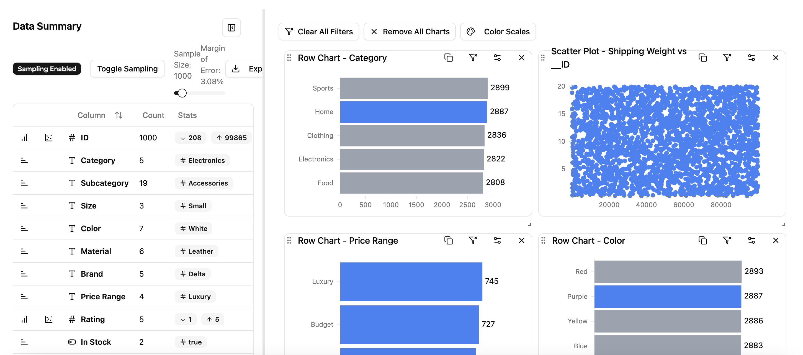

# Data Viz

Tool for exploratory and interactive data analysis.

## Features

Will be updated when done...

## Major work remaining

- Calc engine - around 50% done - add more functions, including special ones

### Core data viz

- Rework how filters are stored in chart settings - need a single `filters` object that can hold different values - rework examples - get switch logic out of various files like `src/hooks/getFilterValues.ts`
- Top level filter + steps = ability to quickly segment data and work on slices
- Add a filter summary + filter controller
- Improve handling of times stamps
- Create a `LineChart` that favors plotting time series data with a line
- Create a `HeatMap` that shows a matrix of values - default to counts
- Create a `BoxPlot` that shows a box plot of the data
- Need a color legend type that can be rendered
- Need a Markdown text type that can be rendered

### Packaging and usages

- Export the core data viewer as a component to be installed elsewhere
- Allow the comp to export the current config so it can be brought into code easily
- Split out the chart components, so that the charting portion can be rented on its own with just data as props make it so that users can use it without needing all of the cross filter machinery still show a setting button that way they can self configure the chart

### Docs and help

- Write up the motivation for the project
- Create a full doc site with helper images
- Create some videos showing usage

## Nice to haves

- Add GPS maps + data display
  - Figure out how to do chloropleth maps
- Add supporting for multiple data sources and relationships
- Add data isolation + "fork" modes - create tabbed interfaces for these
- Create a SPLOM comp that renders scatter plot matrices
- Add a UMAP or TSNE comp that shows clusters from embeddings
- Global color themes

## Small problems

### Chart Visualization and Rendering

- Scatter plot needs to allow new drag filter on off-click if already brushed
- Charts are all missing consistent gridlines
- Clicking on a numerical bar chart should filter by the width of the bar
- Bar chart needs a bunch of visual tweaks
  - Give option to render label on top of bar (instead of to left; affects the axis def)
  - Set a max length on that label
  - Allow ordering by label
  - Allow keeping 0 count items in display to avoid layout shift when filtering
  - Click on `others` to double height of chart
- Scatter points need to render on top of gridlines
- Do not attempt to render points and bars that are not visible due to axis limits
- Decide if it is worth allowing the y categories to be globally shared in Row charts w/ facets
- Row chart should give a warning about missing field instead of rendering undefined - maybe give a drop down immediately
- Row chart should allow clicking anywhere on bar or label to filter - use pointer cursor - give a visual indicator of the filter in case base is small (bold + funnel)
- Put the `clear all filters` button in the main toolbar - make it icon only

### Data Display and Formatting

- Bools should be shown as `true`/`false` not `1`/`0`
- Verify that null detection is working correctly
- Need to build chart title from data fields

### Summary and Pivot Table

- Debounce the slider on the summary table to prevent too many re-renders
- Show the total row count somewhere on the summary table
- Add filtering to the summary table
- Pivot table - implement filtering and sorting
- Summary table causes a render with each column? Do them all in one shot if possible - check time and then RAF to continue
- Need to wire up the "details" view for the pivot table
- Integrate the data summary info into the field chooser drop downs - show icon for field (maybe a count, etc)

### Calculations and Filtering

- Calculation def should describe the available fields created by the calc - default is just producing the calc name - regression would generate estimate, residual, etc. need to declare in advance so drop down menus show what is possible
- A `Region` calc that allows building a 2D mapping and creating regions of assignment
- "Filter to calc" - convert a filter to a calc that segments the data
- Conditional formatting - allow for background regions to appear in charts if some condition is met?

### Settings and Configuration

- Need to implement the full suite of control for axis limits - scatter defaults to all available global data
- Settings that need wired up:
  - Label title overrides
  - Grid lines - tick counts
  - Axis limits
  - Need to hide certain axis settings that cannot be easily changed

### Random

- Animate the `update charts` button - make it smaller too
- Row chart min and max bar sizes don't seem to be working
- Lorenz bar chart for Run ID is missing a bar?
- Pivot table needs supports for sorting and filtering
